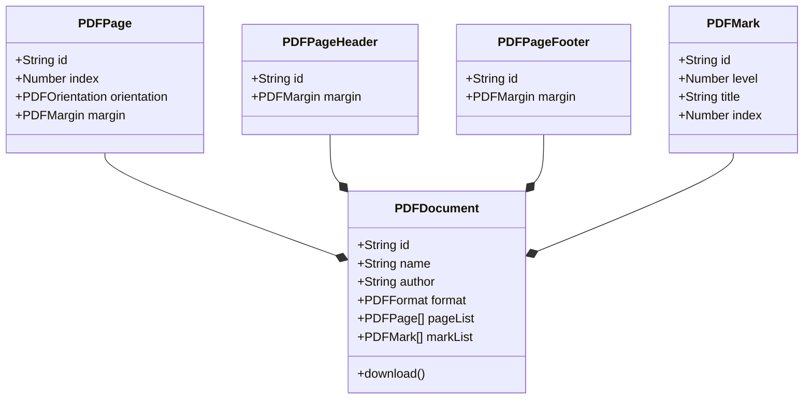

<!--
Created: Tue Apr 12 2022 11:44:41 GMT-0400 (hora de Bolivia)
Modified: Tue Apr 12 2022 11:48:08 GMT-0400 (hora de Bolivia)
-->

# Ngx PDF

> Angular +10 component library for building PDF files on-the-fly

**ngx-pdf** (inspirado en [mPDF](https://mpdf.github.io/)) está construida para desarrolladores Angular, y tiene como finalidad facilitar la codificación y generación de archivos complejos de PDF.

El propósito principal de **ngx-pdf** consiste en convertir **sobre la marcha**, código **HTML** y **CSS** en un archivo **PDF** mediante componentes pre-construidos.

**Ngx-pdf** no genera archivos PDF desde Typescript.

Para mayor entendimiento, revise la [documentación](https://michaellalavedramunayco.github.io/ngx-pdf) y las [demostraciones](https://michaellalavedramunayco.github.io/ngx-pdf)

## Features

* ⬜ Orientación de páginas
* ⬜ Numeración de páginas
* ⬜ Cabecera y pie de página
* ⬜ Grid & Flexbox layout
* ⬜ Marcas de contenido (bookmark)
* ⬜ Tabla de contenido o índice
* ⬜ Imágenes en formato JPG, GIF, PNG, SVG, BMP, WMF
<!-- * 🟩 ... -->

## Prerequisites

Use la versión 10 de Angular o superior

## Install

Para instalar **ngx-pdf** en su proyecto, realice la instalación usando [npm](https://www.npmjs.com/package/@michaelldev/ngx-pdf):

```cmd
npm i @michaelldev/ngx-pdf --save
```

## How to use

Ubique el módulo en donde desee usar **ngx-pdf** y agréguelo en la lista de importación de módulos.

```typescript
import { NgModule } from '@angular/core';
import { NgxPDFModule } from '@michaelldev/ngx-pdf';
...
@NgModule({
  imports: [
    ...
    NgxPDFModule
    ...
  ]
})
export class AnyModule { }
```

Y luego referencie **PDFDocument** en su componente:

```typescript
import { Component, OnInit } from '@angular/core';
import { PDFDocument, PDFFormat } from '@michaelldev/ngx-pdf';
...
@Component({
  selector: 'app-any',
  templateUrl: './any.component.html',
  styleUrls: ['./any.component.less']
})
export class AnyComponent implements OnInit {
  ...
  @ViewChild(PDFDocument) pdfDocument: PDFDocument;
  ...
  constructor () { }
  ...
  ngOnInit():void {

    this.pdfDocument = new PDFDocument({
      name: 'Report 2022',
      format: PDFFormat.A4,
      margin: {
        top: '0.5in',
        right: '0.5in',
        bottom: '0.5in',
        left: '0.5in'
      },
    });
  }
  ...
  onDownload() {
    this.pdfDocument.download();
  }
  ...
}
```

## Documentation

| Componente       | Descripción                                                            |
| :--------------- | :--------------------------------------------------------------------- |
| `pdf-document` | Componente raíz que representa el documento PDF en donde se trabajará. |
| `pdf-header` | Plantilla de cabecera que se incluirá en cada página del documento que se desee. |
| `pdf-footer` | Plantilla de pie de página que se incluirá en cada página del documento que se desee. |
| `pdf-front-page` | Plantilla de la portada que se incluirá en la primera página del documento. |
| `pdf-back-page` | Plantilla de la contraportada que se incluirá en la última página del documento. |
| `pdf-mark-page` | Plantilla de la tabla de contenido o índice que se incluirá después de la portada. |
| `pdf-content` | Plantilla del contenido del documento. |
| `pdf-page` | Declaración de las propiedades de la página en la que se trabaja. |
| `pdf-break-page` | Declaración de salto o corte de página. |
| `pdf-mark` | Declaración de una referencia a una sección del documento que se incluirá en la tabla de contenido. |

## Data Model



## Example

```html
<pdf-document #pdfDocument>

    <pdf-header let-document>
        <ng-container *ngFor="let page of document.pageList; first as firstPage">
            <ng-container *ngIf="!firstPage">
                <div class="flex flex-row flex-between">
                    
                    <span> April 12, 2022 </span>
                </div>
            </ng-container>
        </ng-container>
    </pdf-header>

    <pdf-footer let-document>
        <ng-container *ngFor="let page of document.pageList; first as firstPage; index as pageIndex">
            <ng-container *ngIf="!firstPage">
                <div class="flex flex-row flex-right">
                    {{ pageIndex }} / {{ document.pageList.length }}
                </div>
            </ng-container>
        </ng-container>
    </pdf-footer>

    <pdf-front-page>
        <div class="flex flex-row flex-center"> Report | April 2022 </div>
    </pdf-front-page>

    <pdf-back-page>
        <div class="flex flex-row flex-bottom">
            
        </div>
    </pdf-back-page>

    <pdf-mark-page let-document>
        <ng-container *ngFor="let mark of document.markList">
            <div [className]="'level-' + mark.level">
                {{ mark.title }} ... {{ mark.index }}
            </div>
        </ng-container>
    </pdf-mark-page>

    <pdf-content>

        <div> Report | April 2022 </div>
        <pdf-mark title="Report | April 2022" level="1" />
        <pdf-page orientation="landscape" />

        <pdf-mark title="Product A" level="2" />
        <div class="flex flex-column flex-gap">
            <div class="flex flex-row flex-gap"> Product A </div>
            <div class="flex flex-row flex-gap">
                <p> Local A </p>
                <p> 1 </p>
                <p> $ 49.99 </p>
                <p> $ 49.99 </p>
                <p> 10 January 2022 10:05 AM </p>
            </div>
            <div class="flex flex-row flex-gap">
                <p> Local A </p>
                <p> 2 </p>
                <p> $ 19.99 </p>
                <p> $ 19.99 </p>
                <p> 11 January 2022 12:05 AM </p>
            </div>
            <div class="flex flex-row flex-gap">
                <p> Local B </p>
                <p> 1 </p>
                <p> $ 9.99 </p>
                <p> $ 9.99 </p>
                <p> 11 January 2022 11:05 AM </p>
            </div>
            <div class="flex flex-row flex-gap">
                <p> Local C </p>
                <p> 1 </p>
                <p> $ 5.29 </p>
                <p> $ 5.29 </p>
                <p> 10 January 2022 16:05 PM </p>
            </div>
        </div>

        <pdf-break-page />

    </pdf-content>

</pdf-document>

<button (click)="onDownload()"> Download PDF Report </button>
```

## Feedback

Si tiene alguna sugerencia, recomendación y/o problema relacionado al proyecto, porfavor hágamelo saber mediante una `issue` en la sección `issues` del [repositorio en GitHub](https://github.com/MichaellAlavedraMunayco/ngx-pdf) de este proyecto.

## Credits

**Ngx-pdf** es un proyecto de código abierto como intento de retribuir y colaborar con la comunidad de código abierto.
